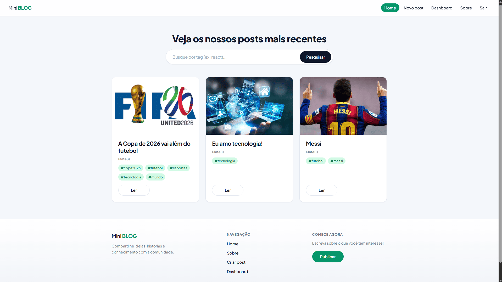
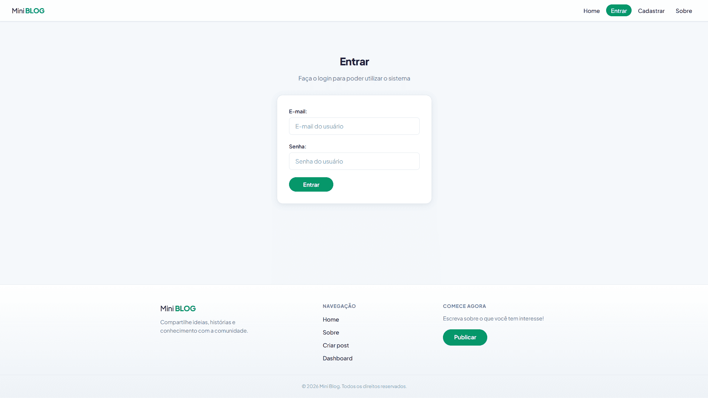
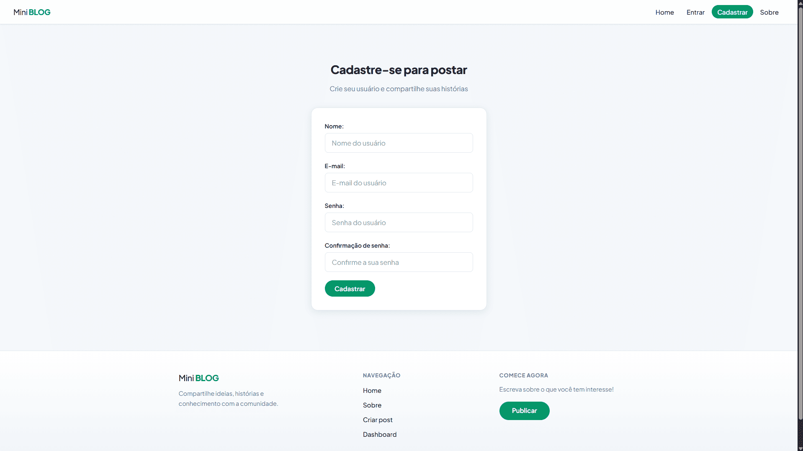
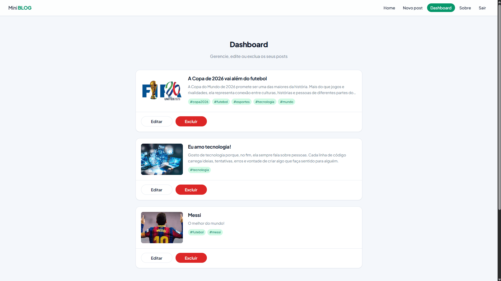

# Mini Blog

Mini Blog é uma aplicação web para publicação e leitura de posts. Usuários autenticados criam e gerenciam conteúdo próprio; visitantes exploram o feed público com busca por tags. Este documento resume a visão do produto, a interface e a organização do repositório.

## Visão geral

O fluxo principal divide-se em **descoberta** (feed na home), **autenticação** (login e cadastro) e **gestão** (criação, edição e exclusão no dashboard). A área pública permanece acessível sem login; alterações nos posts ficam restritas ao autor autenticado.

| Camada        | Tecnologia              | Responsabilidade                          |
| ------------- | ----------------------- | ----------------------------------------- |
| Frontend      | React, Vite             | Interface, rotas e experiência do usuário |
| Persistência  | Firebase Firestore      | Armazenamento de posts e metadados        |
| Autenticação  | Firebase Authentication | Identidade e controle de sessão           |

## Interface do usuário

### Home (`/`)

Feed público em grid. Exibe posts recentes e permite buscar por tag. Não exige autenticação.



### Login (`/login`)

Autenticação por e-mail e senha. Após o acesso, o usuário é redirecionado à home. Inclui enlace para cadastro.



### Cadastro (`/register`)

Criação de conta com nome, e-mail e senha. Habilita a publicação e a gestão de posts.



### Dashboard (`/dashboard`)

Área restrita. Lista os posts do usuário logado, com edição inline e exclusão.



### Demais telas

| Rota             | Descrição                                              | Autenticação |
| ---------------- | ------------------------------------------------------ | ------------ |
| `/posts/:id`     | Leitura completa de um post                            | Não          |
| `/posts/create`  | Formulário de criação (título, imagem, conteúdo, tags) | Sim          |
| `/about`         | Apresentação do projeto                                | Não          |

## Rotas do frontend

| Rota             | Tela        | Autenticação |
| ---------------- | ----------- | ------------ |
| `/`              | Home        | Não          |
| `/login`         | Login       | Não          |
| `/register`      | Cadastro    | Não          |
| `/posts/:id`     | Post        | Não          |
| `/posts/create`  | Criar post  | Sim          |
| `/dashboard`     | Dashboard   | Sim          |
| `/about`         | Sobre       | Não          |

## Estrutura do repositório

```
miniblog/
├── assets/                 # Capturas de tela da documentação
├── src/
│   ├── components/         # Navbar, Footer, PostDetails, Loading
│   ├── pages/              # Home, Login, Register, Dashboard, Post...
│   ├── hooks/              # Autenticação e operações no Firestore
│   ├── context/            # Estado global do usuário
│   ├── firebase/           # Configuração do Firebase
│   └── utils/              # Utilitários (ex.: parsing de tags)
├── .env.example            # Modelo de variáveis de ambiente
└── README.md
```

## Observações

- As tags são informadas separadas por vírgula (ex.: `react, firebase, blog`).
- Credenciais do Firebase devem ser definidas em `.env` com prefixo `VITE_` (consulte `.env.example`).
- As imagens em `assets/` refletem o estado visual atual da interface.
